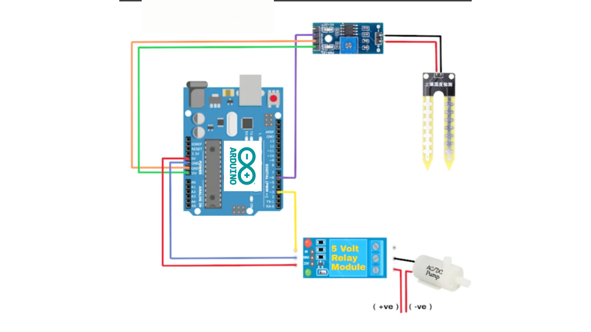

# Automatic Plant Watering System 🌱💧

An Arduino-based project designed to automate the process of watering plants. This system monitors the soil moisture level and activates a water pump only when necessary, ensuring optimal plant health while conserving water. This project was developed for the Digital Logic Design (DLD) lab course.

## 🌟 About the Project

[cite_start]This project aims to create a self-regulating system for plant irrigation, minimizing the need for manual intervention. [cite: 17, 18] [cite_start]It uses a soil moisture sensor to detect the water level in the soil. [cite: 19] [cite_start]When the moisture drops below a set threshold, a 5V relay is triggered, which activates a water pump to irrigate the plant until the desired moisture level is achieved. [cite: 20]

### Key Objectives
* [cite_start]**Automation:** Automatically water plants based on real-time soil moisture data. [cite: 39]
* [cite_start]**Water Conservation:** Provide a precise amount of water only when needed to prevent waste. [cite: 22, 40]
* [cite_start]**Improved Plant Health:** Ensure consistent and optimal moisture levels for healthy plant growth. [cite: 23]
* [cite_start]**Hands-On Learning:** Gain practical experience with microcontrollers, sensors, and system integration. [cite: 42]

## 🛠️ Hardware Components

| Component           | Purpose                                                                |
| ------------------- | ---------------------------------------------------------------------- |
| **Arduino Uno** | [cite_start]The microcontroller that serves as the brain of the system. [cite: 27]       |
| **Soil Moisture Sensor** | [cite_start]Measures the volumetric water content in the soil. [cite: 28]                 |
| **5V Relay Module** | [cite_start]Acts as an electronically controlled switch to safely turn the water pump on/off. [cite: 30] |
| **Mini Water Pump** | [cite_start]The pump used to deliver water to the plant. [cite: 32]                         |
| **Jumper Wires** | To connect all the components together.                                |

## ⚙️ How It Works

The system follows a simple but effective logic:

1.  **Sensor Reading:** The soil moisture sensor is placed in the plant's soil. It has a digital output (DO) that goes **HIGH** when the soil is sufficiently moist and **LOW** when it is dry.
2.  [cite_start]**Arduino Processing:** The Arduino Uno continuously reads the digital signal from the sensor on pin 6. [cite: 52, 78]
3.  **Pump Control:**
    * [cite_start]If the sensor reads **HIGH** (wet soil), the Arduino sends a **LOW** signal to the relay module connected to pin 3. This deactivates the relay, turning the water pump **OFF**. [cite: 79, 80]
    * If the sensor reads **LOW** (dry soil), the Arduino sends a **HIGH** signal to the relay module. [cite_start]This activates the relay, turning the water pump **ON**. [cite: 83]

### Circuit Connections

| From               | To                                      |
| ------------------ | --------------------------------------- |
| **Soil Sensor VCC**| Arduino 5V                              |
| **Soil Sensor GND**| Arduino GND                             |
| **Soil Sensor DO** | Arduino Digital Pin 6                   |
| **Relay Module VCC** | Arduino 5V                              |
| **Relay Module GND** | Arduino GND                             |
| **Relay Module IN**| Arduino Digital Pin 3                   |
| **Water Pump +ve** | Relay COM & External Power +ve          |
| **Water Pump -ve** | External Power -ve                      |

*Note: The water pump should be powered by an external power source, as the Arduino cannot provide enough current.*

## 🚀 How to Use

1.  **Assemble the circuit** as shown in the diagram.
2.  [cite_start]**Upload the code** (`Plant_Watering_System.ino`) to your Arduino Uno board. [cite: 56]
3.  **Place the soil sensor** into the soil of your plant.
4.  **Power up** the Arduino and the external power supply for the pump.
5.  The system will now automatically water your plant whenever the soil gets too dry!

## 🔮 Future Enhancements

* [cite_start]**IoT Integration:** Use an ESP8266 or ESP32 to send sensor data to the cloud and control the system remotely via a web dashboard or mobile app. [cite: 115]
* **Multiple Plants:** Expand the system with more sensors and valves to manage multiple plants independently.
* [cite_start]**Data Logging:** Store moisture data over time to analyze water consumption and plant health trends. [cite: 117]

---
*Project by: Muhammad Haroon*
[cite_start]*SZABIST ISB, BS-AI-2A. [cite: 12, 13]*
